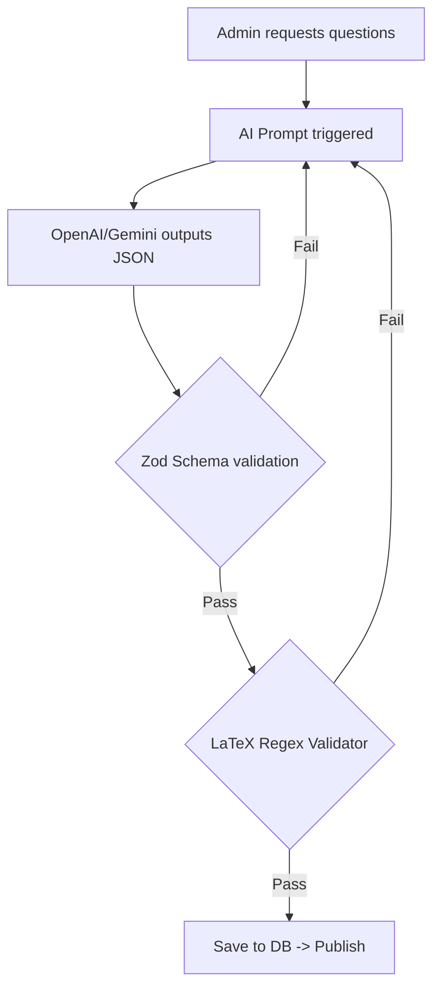

# SPEC: AI QUESTION ENGINE

## 1. Executive Summary
Xây dựng hệ thống "bộ não" kiểm duyệt tự động dành cho AI sinh đề Toán, nhằm tránh rách giao diện (HTML/LaTeX) và rò rỉ đáp án trong iTongQuiz.

## 2. User Stories
- Là một Hệ thống AI, tôi cần có quy tắc ngầm định về việc viết phân số đúng chuẩn MathJax để hiển thị lên app.
- Là một API Backend, tôi cần 1 validator để ném lỗi ngay nếu AI trả về chuỗi công thức sai cú pháp (số lượng ngoặc đô la `$`, dấu ngoặc nhọn `{}`).
- Là Front-end / Giáo viên, tôi cần một Zod Schema cứng để bóc tách rõ mảng `blanks` với chuỗi `text`.

## 3. Database Design
- Cấu trúc lưu trữ giống hệ thống thẻ Questions hiện tại, tuy nhiên cần parse JSON schema được sinh ra:
```ts
interface GeneratedQuestion {
  text: string;
  blanks: { id: string, answer: string, options?: string[] }[];
}
```

## 4. Logic Flowchart


## 5. API Contract
- `POST /api/ai/generate`
  - Body: `{ topic: "Phân số", difficulty: "Easy", count: 5 }`
  - Response: `{ questions: GeneratedQuestion[] }`

## 6. UI Components
- Hiện đã có `QuestionRenderer.tsx` để hiển thị.
- Tính năng tương lai: `PreviewDraftModal.tsx` để giáo viên xem trước và sửa lỗi.

## 7. Tech Stack
- Next.js API Routes (Hoặc Server Actions)
- Zod (Schema validation)
- Vercel AI SDK / OpenAI SDK
